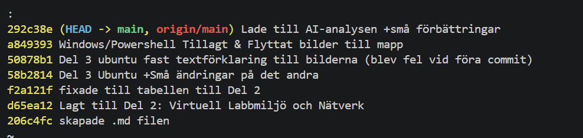
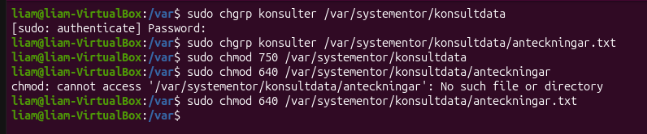
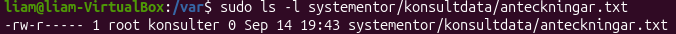
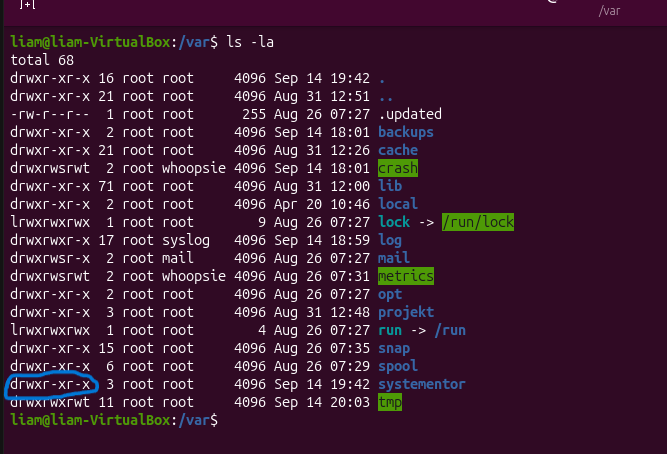
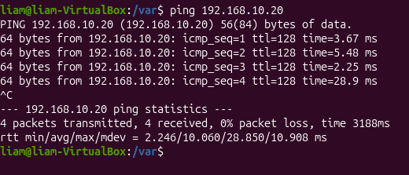
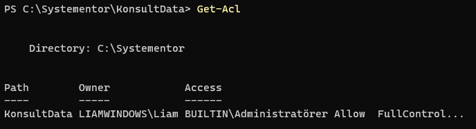
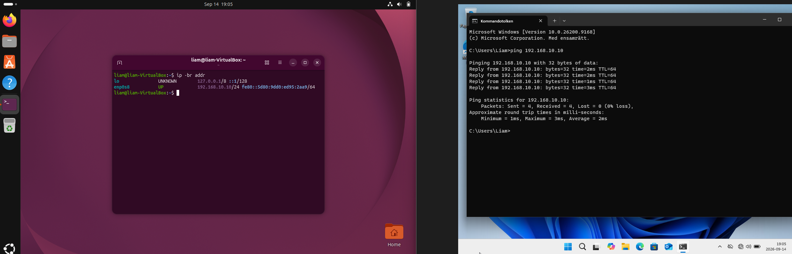
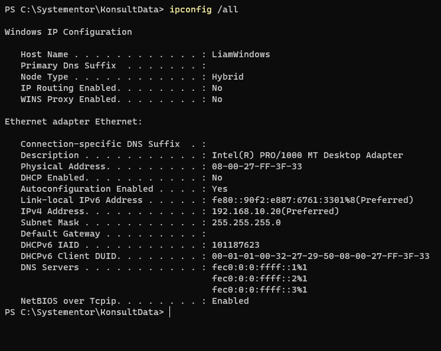

# Liam Jakobssons Indivudella inlämmningsuppgift
## Kurs 1 - Introduktion till yrkesrollen och grunderna i IT-infrastruktur
### Liam Jakobsson  2026-09-14 -> 2026-09-21
**Detta är min individuella uppgift om Labbmiljöer, Git, CLI, AI**

*Min git-historik*<br>


### Del 2: Virtuell Labbmiljö & Nätverk

| Hostname | Operativsystem | IP-adresser | Subnätmask | Standard Gateway |
| --- | --- | --- | --- | --- |
| liam-Virtualbox | Ubuntu 26.04.1 LTS | 192.168.10.10 | 255.255.255.0 | Ingen |
| LiamWindows | Windows 11 Home | 192.168.10.20 | 255.255.255.0| Ingen |

### Del 3: Kommandoradsarbete & Felsökning
**Ubuntu/bash**

*Skapar mappen och .txt filen* <br>


*Skapar gruppen "Konsulter"* <br>


*Tilldelar behörigheten till mappen samt .txt filen* <br>



*Inspekterar behörigheterna*<br>
 <br>



*Pingar från Ubuntu till Windows*<br>


**Windows/Powershell**

*Skapade mappen Systementor med undermappen KonsultData* <br>


*Inspekterar behörighetsstrukturen*<br>



*Ping från Windows till Ubuntu*<br>



*Kollar på Hur Adresserna är konfigurerade*<br>



**Del 4: AI-stöd & Kritisk Utvärdering**

**AI-loggen:**

Jag använde mig av ``GPT-5.6 Sol Light``

**Prompt:**
*Hur ger jag en användargrupp rätt att läsa och ändra en fil?*

**GPT Svar:**<br>
I linux gör du så här:
```
sudo chgrp gruppnamn fil.txt 
sudo chmod 660 fil.txt
```
* ``chgrp`` kopplar filen till användargruppen.
* ``chmod 660`` ger:
* Ägaren: Läsa och ändra (``rw-``)
* Gruppen: Läsa och ändra (``rw-``)
* Övriga: inga rättigheter (``---``)

Exempel för gruppen ``Gruppen``:
```
Bash
sudo chgrp Gruppen anteckningar.txt
sudo chmod 660 anteckningar.txt
```
Kontrollera resultatet:
```
Bash
ls -l anteckningar.txt
```
Det ska ungefär visas som:
```
-rw-rw---- 1 användare Gruppen ... anteckningar.txt
```
Användarna måste också vara medlemmar i gruppen:
```
Bash
sudo usermod -aG Gruppen användarnamn
```
Användaren behöver därefter logga ut och in igen för att gruppmedlemskapet ska börja gälla.

**Slut på svar**

**Utvärdering:**<br>
Koden var korrekt, den gjorde det jag ville med Bash-terminalen, något jag använt som mest. Den missade dock att ut- och inloggning inte är enda sättet att aktivera gruppmedlemskapet. Även att kommandona fungerar bevisar dock inte att behörigheterna är lämpliga. Jag upptäckte inga hallucinationer, föråldrade kommandon eller säkerhetsbrister i AI svaret.

**hur säkerställde jag AIns svar?**<br>
Jag använde min virtuella Ubuntu maskin för att verifiera att alla kommandon jag använde stämde överäns med svaren som AIn visade. En förbättring skulle vara en tydligare förklaring på vad varje rad gjorde samt flagga, men det kan dock lösas i prompten.